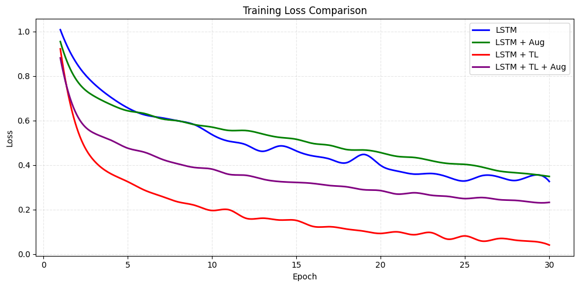
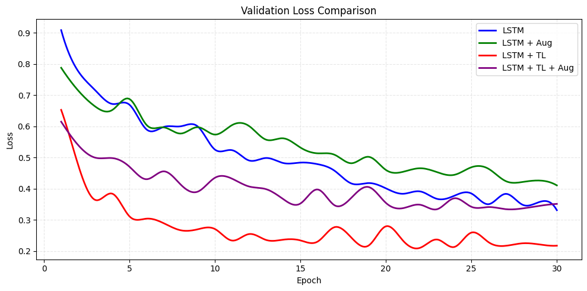

## Early Detection Brain Tumor using LSTM

  
  
  
  

The rapid development of deep learning has opened new opportunities in the medical field, particularly in medical image analysis. One critical application is the early detection of brain tumors, which plays a vital role in improving patient diagnosis and treatment planning. Brain tumors often require accurate and timely identification to reduce risks and increase survival rates.

This project focuses on early brain tumor detection using Long Short-Term Memory (LSTM) by learning sequential patterns extracted from brain MRI images. By leveraging deep learning, this system aims to support medical professionals with an automated and efficient classification approach.

### Table of Contents
- [Dataset](#dataset)
- [Data Augmentation](#data-augmentation)
- [Libraries](#libraries)
- [Models](#models)
- [Results](#results)

### Dataset
The dataset used in this project consists of brain MRI images with three tumor classes:

- Pituitary Tumor
- Meningioma
- Glioma

Originally, the dataset was provided in MATLAB (.mat) format and later converted into JPG image format to simplify image preprocessing and model training. Each class represents a different type of brain tumor commonly found in clinical diagnosis.

### Data Augmentation
To enhance feature representation and improve model robustness, feature-based augmentation was applied by extracting edge and texture information from the MRI images.

The augmentation process includes:
- **Edge Detection** to highlight tumor boundaries
- **Texture Extraction** to capture structural patterns in brain tissue

The augmented images were stored in [Google Drive](https://drive.google.com/drive/folders/14CWPUGn-xj74B1kgll3cLTtmutz9CsZQ?usp=sharing)

### Libraries
The following Python libraries are used in this project:

<pre>
import os
import numpy as np
import tensorflow as tf
from tensorflow.keras.models import Model
from tensorflow.keras.layers import (Input, Dense, Dropout, Flatten, Reshape,
                                     LSTM, LayerNormalization, MultiHeadAttention, GlobalAveragePooling1D)
from tensorflow.keras.preprocessing.image import load_img, img_to_array
from tensorflow.keras.utils import to_categorical
from tensorflow.keras.optimizers import Adam
from tensorflow.keras.callbacks import EarlyStopping, ModelCheckpoint
from sklearn.model_selection import train_test_split
from sklearn.utils.class_weight import compute_class_weight
from imblearn.over_sampling import SMOTE
</pre>

### Models
This project uses the Long Short-Term Memory (LSTM) model to classify brain tumor images.

### Results

